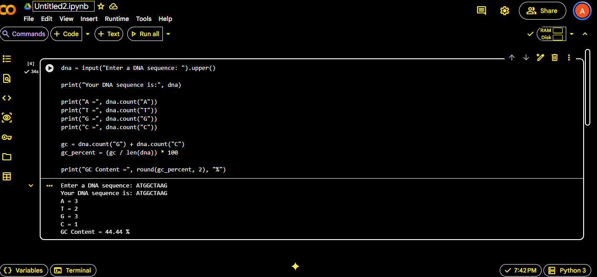

 DNA Sequence Analyzer

A beginner Bioinformatics mini project built using Python.

📌 Project Description

This program takes a DNA sequence as input and analyzes it by:

- Counting the number of A, T, G, and C nucleotides.
- Calculating the GC Content (%) of the sequence.

💻 Technologies Used

- Python
- Google Colab

▶️ Sample Input

ATGGCTAAG

✅ Sample Output

Your DNA sequence is: ATGGCTAAG

A = 3
T = 2
G = 3
C = 1

GC Content = 44.44 %
## Project Output

